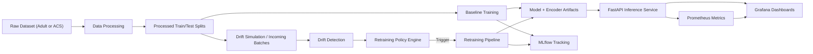

# Drift-Aware MLOps Pipeline: Complete Project Implementation

## 1. Project Purpose

This project implements an end-to-end MLOps system for tabular binary classification with a focus on **drift-aware model lifecycle management** rather than only raw predictive performance.

The main goal is to answer a practical research question:

How should a production model decide when to retrain as data changes over time?

To answer that, the repository combines:

- Data ingestion and preprocessing
- Feature encoding and model training
- Batch-wise drift simulation
- Feature-level and batch-level drift scoring
- Policy-based retraining decisions
- Model versioning and experiment tracking with MLflow
- A FastAPI inference service
- Containerization with Docker
- Operational monitoring with Prometheus and Grafana
- CI validation with GitHub Actions

---

## 2. End-to-End Architecture



At a high level, the system works like this:

1. A dataset is loaded and cleaned.
2. Processed train and test splits are saved.
3. An XGBoost baseline model is trained.
4. The model and encoder are saved locally and optionally logged to MLflow.
5. The API serves predictions from the latest saved artifacts.
6. Sequential evaluation batches are generated or consumed.
7. Each batch is checked for drift.
8. A retraining policy decides whether model refresh is justified.
9. If triggered, the model is retrained, the encoder is refit, and the API can hot-reload the new version.
10. Prometheus scrapes runtime metrics and Grafana visualizes them.

---

## 3. Repository Layout

```text
MLOPS_Project/
├── api/
│   └── app.py
├── configs/
│   ├── settings.yaml
│   ├── settings_acs.yaml
│   ├── thresholds.yaml
│   ├── drift_config.yaml
│   └── drift_config_acs.yaml
├── data/
│   ├── raw/
│   ├── processed/
│   └── batches/
├── docker/
│   ├── Dockerfile
│   ├── Dockerfile.mlflow
│   ├── docker-compose.yml
│   └── prometheus.yml
├── experiments/
│   ├── run_experiments.py
│   └── run_comprehensive.py
├── monitoring/
│   └── grafana/
├── models/
├── reports/
├── src/
│   ├── data_processing.py
│   ├── feature_encoding.py
│   ├── train.py
│   ├── evaluate.py
│   ├── drift_simulation.py
│   ├── drift_detection.py
│   ├── policy_engine.py
│   ├── retrain.py
│   └── utils.py
├── tests/
├── .github/workflows/ci.yml
├── Makefile
├── README.md
└── Project_Implementation.md
```

---

## 4. Data Layer

### 4.1 Supported Dataset Profiles

The project supports two data profiles:

- `adult` via `configs/settings.yaml`
- `acs` via `configs/settings_acs.yaml`

The active profile is selected with:

```bash
SETTINGS_FILE=configs/settings_acs.yaml python -m src.data_processing
```

If `SETTINGS_FILE` is not provided, the pipeline defaults to `configs/settings.yaml`.

### 4.2 Adult Dataset Path

For the Adult profile:

- Raw files are expected in `data/raw/`
- `adult.data` and `adult.test` are combined
- Column names are standardized
- Missing categorical values are imputed with the mode
- Missing numeric values are imputed with the median
- Duplicate rows are removed
- The cleaned data is split into train and test partitions

### 4.3 ACS Dataset Path

For the ACS profile:

- Data is fetched with `folktables`
- The project uses the ACS Income formulation
- The fetched data can be cached under `data/raw/folktables_cache/`
- A local snapshot can be saved and reused, but snapshot persistence is now optional
- The ACS profile now supports **multi-year ingestion** through `survey_years`
- Separate processed outputs are written using profile-specific filenames:
  - `train_acs_multiyear.csv`
  - `test_acs_multiyear.csv`
- The preprocessing path can run in a memory-efficient state-by-state mode
- ACS preprocessing can resume via per-state shard files after interruption
- Multi-year ACS runs annotate each row with a `DATA_YEAR` metadata column

This separation prevents the ACS run from overwriting the Adult processed splits.

### 4.4 Data Processing Module

`src/data_processing.py` is responsible for:

- loading the active dataset profile
- cleaning and standardizing the data
- stratified train/test splitting
- saving processed outputs

The project now resolves processed train/test output names from config rather than hardcoding `train.csv` and `test.csv`.

For large ACS runs, the pipeline now avoids loading the entire national dataset into memory at once. Instead, it:

- loads one state at a time
- loops over one year at a time when multiple survey years are configured
- cleans and splits that state independently
- writes per-state-per-year shards
- combines those shards into the final ACS processed outputs

This was added after the original all-at-once ACS preprocessing path proved too memory-intensive for long WSL runs.

For the latest multi-year ACS path, the pipeline can also perform a **temporal split**:

- earliest configured year(s) become the baseline training set
- later year(s) become the evaluation pool
- this avoids leaking future-year examples into the baseline model

---

## 5. Feature Engineering and Encoding

### 5.1 Encoding Strategy

`src/feature_encoding.py` uses:

- `OrdinalEncoder` for categorical features
- `LabelEncoder` for the binary target

This is a deliberate choice because:

- XGBoost works well with compact numeric encodings
- one-hot encoding would expand dimensionality unnecessarily
- drift detection remains easier to interpret at the original feature level

### 5.2 Unknown Category Handling

The encoder uses:

- `handle_unknown="use_encoded_value"`
- `unknown_value=-1`

That allows inference and evaluation to continue even when previously unseen categories appear.

### 5.3 Retraining Improvement

Originally, retraining reused the old encoder. That was risky for larger ACS-style data because newly observed category values would keep collapsing to `-1`.

The retraining flow now refits a **fresh encoder on the accumulated retraining dataset** before model training. This is one of the most important implementation upgrades in the current version.

---

## 6. Model Training

### 6.1 Baseline Model

The main production model is:

- `XGBoost Classifier`

Configured through `settings.yaml` or `settings_acs.yaml`.

Current default parameters include:

- `n_estimators: 200`
- `max_depth: 6`
- `learning_rate: 0.1`
- `subsample: 0.8`
- `colsample_bytree: 0.8`

For ACS, the settings profile can also request GPU-backed XGBoost training. The training code now:

- tries `device: cuda` when `use_gpu: true`
- keeps `tree_method: hist`
- falls back automatically to CPU training if CUDA execution is unavailable at runtime

### 6.2 Training Pipeline

`src/train.py` performs:

1. load processed data
2. fit the encoder on training data
3. transform train and test splits
4. train the XGBoost model
5. compute evaluation metrics
6. save the model and encoder
7. optionally log metrics and artifacts to MLflow

The baseline ACS training path has already been validated on a large processed dataset using GPU-backed fitting.

### 6.3 Training Outputs

The training pipeline writes:

- model artifact in `models/`
- encoder artifact in `models/`
- metrics to logs
- metrics and artifacts to MLflow when enabled

---

## 7. Evaluation

`src/evaluate.py` centralizes the evaluation logic.

The standard metrics are:

- accuracy
- F1
- precision
- recall

The module also includes helpers to:

- build detailed classification reports
- evaluate multiple batches
- convert metrics to DataFrames
- extract core metrics for policy logic
- compute labeled performance drops versus a baseline

Those metric-drop utilities are now important because the retraining policy can respond not only to feature drift, but also to **observed concept drift through performance degradation**.

---

## 8. Drift Simulation

### 8.1 Purpose

The project studies model lifecycle behavior under changing data, so it needs a repeatable way to generate sequential drift scenarios.

That is the role of `src/drift_simulation.py`.

### 8.2 Drift Types Supported

The simulator supports:

- covariate shift
- conditional shift
- feature-importance-style noise injection

### 8.3 Dataset-Specific Drift Configs

There are now two drift configs:

- `configs/drift_config.yaml` for Adult
- `configs/drift_config_acs.yaml` for ACS

The loader in `src/utils.py` automatically picks the ACS version when the ACS profile is active, unless `DRIFT_CONFIG_FILE` overrides it.

### 8.4 Why This Matters

This change removes one of the major earlier limitations of the repository:

the previous drift simulation referred to Adult-specific columns such as `age`, `education`, and `capital-gain`, which did not transfer cleanly to ACS-derived runs.

### 8.5 Research-Quality ACS Drift Design

The ACS drift schedule has been expanded beyond the original short demo-style setup. The current ACS profile now uses a longer multi-batch sequence with:

- mild early covariate drift
- categorical redistribution
- repeated concept-drift regimes
- mixed drift batches that combine covariate, concept, and feature-importance distortion
- late-stage persistent severe drift

This change was made because a short 5-batch schedule did not produce strong enough evidence for adaptive retraining in the research experiments. The longer ACS schedule is intended to create a more realistic temporal horizon for model degradation and recovery.

---

## 9. Drift Detection

### 9.1 Detector Design

`src/drift_detection.py` implements a two-layer detector.

#### Layer 1: Feature-Level Statistical Tests

- Numerical features: Kolmogorov-Smirnov test
- Categorical features: Chi-square comparison

Each feature produces:

- test statistic
- raw p-value
- corrected p-value
- effect size
- drift flag
- drift magnitude

#### Layer 2: Global Severity Score

The detector aggregates per-feature movement into a batch-level severity score.

### 9.2 Multiple Testing Control

Supported correction methods:

- `bonferroni`
- `benjamini-hochberg`

Configured in `configs/thresholds.yaml`.

### 9.3 Severity Formula Upgrade

The earlier implementation used a very conservative score:

`severity = (n_drifted / n_total) * mean_effect`

That made thresholds like `0.3` unrealistically hard to reach.

The current implementation uses a stronger blended score made from:

- drift ratio
- mean effect among drifted features
- mean overall effect across all tested features

This makes the severity more informative while still bounded between `0` and `1`.

### 9.4 Important Limitation

Feature drift detection alone cannot detect concept drift when feature distributions stay roughly stable but the label relationship changes.

That is why the retraining policy now also uses **labeled performance degradation signals**.

---

## 10. Retraining Policy Engine

`src/policy_engine.py` decides whether a retrain should occur.

### 10.1 Current Policy Gates

The policy now evaluates:

- feature drift severity threshold
- concept drift threshold from labeled metric drops
- persistence of drift or concept-drift signals across consecutive batches
- minimum new labeled sample count
- cooldown batches since the last retrain

### 10.2 Signal Combination

The configuration supports:

- `signal_combination: "either"`
- `signal_combination: "all"`

In the default setup, `"either"` means retraining can be triggered by:

- significant feature drift
- or significant labeled performance degradation

as long as sample and cooldown gates are also satisfied.

The current implementation also supports **persistence gating**. In the latest methodology update, the default policy requires the drift signal to persist for 2 consecutive batches before retraining is allowed.

### 10.3 Concept Drift Triggers

Configured thresholds currently include:

- minimum F1 drop
- minimum recall drop

This is important for scenarios like conditional shift where the feature distributions may not move enough to create a strong statistical drift signal, but model quality still worsens.

The concept-drift thresholds were also relaxed from the earlier stricter setting so that sustained labeled degradation can trigger retraining more reliably in larger ACS experiments.

---

## 11. Retraining Pipeline

`src/retrain.py` implements the retraining lifecycle.

### 11.1 Inputs

It accepts:

- newly accumulated labeled data
- existing training data
- the version manager
- MLflow toggle

### 11.2 Current Retraining Flow

1. Build a retraining dataset from a recent rolling window of batches
2. Add a small stratified anchor sample from the original training set
3. Refit a fresh encoder on that bounded raw dataset
4. Encode the full retraining dataset
5. Split with a shuffled stratified train/validation split
6. Train a new XGBoost model
7. Save the new model and encoder
8. Log retraining metrics to MLflow
9. Update retraining history

This rolling-window design replaced the earlier “all old + all new” accumulation strategy because it was too likely to dilute recent drift regimes and slow adaptation.

### 11.3 Version Management

`ModelVersionManager` tracks:

- current version number
- retraining history

Saved models use versioned names such as:

- `xgb_model_v1.pkl`
- `xgb_model_v2.pkl`

---

## 12. Experiment Tracking with MLflow

### 12.1 Role of MLflow

MLflow is used for:

- logging model hyperparameters
- logging batch and training metrics
- storing model artifacts
- storing encoder artifacts
- comparing baseline and retrain runs

### 12.2 Where It Is Configured

MLflow configuration lives in:

- `configs/settings.yaml`
- `configs/settings_acs.yaml`

The training and retraining pipelines both call MLflow directly when `use_mlflow=True`.

### 12.3 MLflow Container

`docker/Dockerfile.mlflow` defines a lightweight MLflow server container.

It exposes:

- port `5000`

It is configured to use:

- SQLite backend store
- filesystem artifact storage

This gives the project a self-contained experiment tracking option for local use.

### 12.4 Practical Note

The current `docker-compose.yml` brings up API, Prometheus, and Grafana. MLflow has its own Dockerfile and storage directories, but it is not yet wired as a compose service in the current compose file. The implementation document should treat MLflow as present and integrated at the code level, but only partially containerized at the compose-orchestration level.

---

## 13. Inference Service

### 13.1 API Framework

The inference layer is implemented with **FastAPI** in `api/app.py`.

### 13.2 Core Endpoints

- `GET /health`
- `POST /predict`
- `POST /reload-model`
- `POST /internal/update-drift-metrics`
- `GET /metrics` via mounted Prometheus ASGI app

### 13.3 API Behavior

At startup, the service:

- loads the latest encoder
- loads the highest-version model from `models/`
- stores them in memory

### 13.4 Hot Reload

`/reload-model` allows the API to:

- load the latest saved artifacts
- switch to the new model in memory
- avoid requiring a container restart

This is a key operational feature for retraining-driven deployment.

### 13.5 Dataset-Agnostic Request Shape

The API previously used an Adult-specific request schema.

It now accepts:

- `records: List[dict[str, Any]]`

and validates required columns against the currently loaded encoder feature list.

That makes the same service usable with either Adult or ACS-style schemas, as long as the request columns match the trained model profile.

---

## 14. Docker Integration

### 14.1 API Container

`docker/Dockerfile` packages the inference service.

It:

- uses `python:3.12-slim`
- installs build tools and Python dependencies
- copies the project into `/app`
- sets `PYTHONPATH=/app`
- exposes port `8000`
- starts `uvicorn api.app:app`

### 14.2 Compose Orchestration

`docker/docker-compose.yml` currently defines:

- `api`
- `prometheus`
- `grafana`

The API container mounts:

- `../configs` as read-only
- `../models` as read-only

This lets the running service use host-generated configs and newly trained models without rebuilding the image for every model refresh.

### 14.3 Service Ports

Current local ports:

- API: `8080 -> 8000`
- Prometheus: `9090`
- Grafana: `3000`

### 14.4 Operational Role of Docker

Docker provides:

- reproducible runtime packaging
- consistent local deployment
- easy monitoring stack startup
- a clean boundary between training artifacts and serving infrastructure

---

## 15. Prometheus Integration

### 15.1 Configuration

Prometheus is configured by `docker/prometheus.yml`.

It scrapes:

- `api:8000`

at a `5s` interval.

### 15.2 Metrics Exposed by the API

The FastAPI app exports:

- `prediction_requests_total`
- `prediction_latency_seconds`
- `current_model_version`
- `drift_severity`
- `retrain_events_total`

These are enough to monitor:

- traffic volume
- serving latency
- active model version
- latest drift score
- retraining activity

---

## 16. Grafana Integration

### 16.1 Datasource Provisioning

Grafana datasource provisioning is defined in:

- `monitoring/grafana/provisioning/datasources/datasource.yml`

It points Grafana to:

- `http://prometheus:9090`

### 16.2 Dashboard Provisioning

Dashboard auto-loading is configured in:

- `monitoring/grafana/provisioning/dashboards/dashboard.yml`

### 16.3 Dashboard Assets

The repository includes:

- `monitoring/grafana/dashboards/mlops_dashboard.json`

This gives the project a pre-provisioned dashboard path for:

- drift score visualization
- latency monitoring
- retraining event visibility
- live operational observability

---

## 17. CI/CD Integration

### 17.1 GitHub Actions Workflow

The CI pipeline is defined in:

- `.github/workflows/ci.yml`

### 17.2 What CI Currently Does

On pushes and pull requests to `main`, CI:

1. checks out the repo
2. sets up Python 3.12
3. installs dependencies
4. runs `flake8`
5. downloads a small slice of Adult data for tests
6. runs `src.data_processing`
7. runs `src.train --no-mlflow`
8. runs `pytest`

### 17.3 Why This Design Was Chosen

This CI strategy validates:

- code quality
- pipeline syntax and execution
- training path correctness
- API readiness

without requiring a full production-scale dataset during CI.

### 17.4 Current Scope of CI/CD

What is automated now:

- linting
- test execution
- data and training smoke path validation

What is only partially automated:

- model deployment orchestration
- MLflow container startup
- end-to-end retraining-triggered redeployment

So this project is best described as:

**a strong local MLOps implementation with CI validation and partial deployment automation**

rather than a fully productionized cloud-native platform.

---

## 18. Tool Usage Summary

This section summarizes how the major tools and frameworks were used in the final implementation.

### 18.1 Python

Python is the primary implementation language for:

- preprocessing
- feature encoding
- model training
- retraining
- drift detection
- policy logic
- experiment orchestration
- API serving

### 18.2 XGBoost

XGBoost is the core classification model used for:

- baseline supervised training
- retraining after drift events
- model comparison across experiment conditions

The ACS configuration also supports CUDA-backed training on compatible NVIDIA GPUs.

### 18.3 Folktables

Folktables is used specifically in the ACS profile to:

- fetch ACS PUMS data
- map raw ACS records into the ACS Income task
- support reproducible ACS-derived experiments

### 18.4 FastAPI

FastAPI is used to implement the inference service. Its role includes:

- serving batch prediction requests
- exposing a health endpoint
- supporting model hot-reload through `/reload-model`
- exposing Prometheus-scrapable metrics

This gives the project a realistic lightweight deployment interface rather than an offline-only research script.

### 18.5 Docker

Docker is used to package the runtime services and make local deployment reproducible.

In this project, Docker is used for:

- packaging the FastAPI inference service
- running Prometheus
- running Grafana
- defining a local multi-service stack through `docker-compose`

Docker separates the serving and monitoring runtime from the notebook/script environment and makes the stack easier to reproduce on another machine.

### 18.6 MLflow

MLflow is used for experiment tracking and artifact management.

It is used to:

- log model hyperparameters
- log baseline and retraining metrics
- store model artifacts
- store encoder artifacts
- preserve run history for later comparison

The codebase integrates MLflow directly in both the baseline training and retraining pipelines. A dedicated MLflow Dockerfile is also included for local server deployment.

### 18.7 Prometheus

Prometheus is used for metrics collection from the live API service.

It collects:

- prediction request counts
- prediction latency
- current model version
- current drift severity
- retraining event counts

This gives the project a monitoring layer that reflects operational behavior rather than only offline evaluation.

### 18.8 Grafana

Grafana is used as the visualization layer for operational metrics.

It is used to:

- visualize drift signals
- visualize latency and service behavior
- track retraining events
- provide a dashboard-based monitoring surface over Prometheus data

### 18.9 GitHub Actions

GitHub Actions is used for CI validation.

It automates:

- dependency installation
- linting with `flake8`
- data and training smoke execution
- test execution with `pytest`

This ensures that code changes are checked automatically even though the full research workload still runs locally.

### 18.10 Makefile

The Makefile acts as a lightweight task runner for local operations.

It is used to simplify:

- environment setup
- testing
- training
- drift scripts
- Docker build and startup
- cleanup

### 18.11 Matplotlib

Matplotlib is used for experiment visualizations such as:

- batch-wise performance curves
- drift timelines
- retraining event plots
- cost-versus-performance scatter plots

These plots support the research-reporting layer of the project.

### 18.12 Pytest

Pytest is used to validate:

- data pipeline behavior
- training behavior
- drift detector behavior
- policy engine behavior
- API behavior

It gives confidence that the modular components still work together after changes to the system.

---

## 19. Local Automation via Makefile

The `Makefile` provides simple entry points for common tasks:

- `make setup`
- `make test`
- `make train`
- `make retrain`
- `make drift`
- `make build`
- `make up`
- `make down`
- `make clean`

This is useful because it gives a reproducible operator workflow even outside CI.

Typical local lifecycle:

```bash
make setup
python -m src.data_processing
python -m src.train --no-mlflow
make build
make up
python -m src.drift_simulation
python -m src.drift_detection
```

For ACS:

```bash
SETTINGS_FILE=configs/settings_acs.yaml python -m src.data_processing
SETTINGS_FILE=configs/settings_acs.yaml python -m src.train --no-mlflow
SETTINGS_FILE=configs/settings_acs.yaml python -m src.drift_simulation
```

---

## 20. Experiments and Research Flow

The experiments are orchestrated in:

- `experiments/run_experiments.py`
- `experiments/run_comprehensive.py`

These scripts compare:

- static deployment
- immediate retraining
- policy-based retraining
- threshold sensitivity settings

The experiment logic has been improved in several ways during this implementation cycle:

- batch loading is no longer hardcoded to 5 batches
- the `Immediate` baseline now retrains only when a true drift or concept-drift trigger occurs
- report paths are dataset-profile-specific so ACS runs do not overwrite Adult reports
- the summary logic now computes recovery-oriented metrics in addition to simple mean accuracy and mean F1

Examples of additional research metrics now supported in the experiment summaries include:

- worst-batch accuracy
- worst-batch F1
- mean and max degradation from the batch-1 baseline
- cumulative degradation area from the batch-1 baseline
- number of concept-drift batches
- number of drift-alert batches
- mean next-batch F1 recovery after retraining
- post-retrain average F1

They use:

- baseline training
- drift detection
- policy evaluation
- retraining logic
- optional API traffic replay
- plot generation
- markdown report generation

The comprehensive runner also pushes traffic into the live API to populate Prometheus and Grafana during simulated runs.

This creates two complementary experiment modes:

- a local research runner for method development
- a live-stack runner for operational validation with Docker, Prometheus, and Grafana in the loop

### 20.1 Final ACS Methodology Upgrades

The latest ACS experiment round introduced four major research-method improvements:

- a 12-batch ACS drift horizon instead of the shorter earlier schedule
- sustained concept-drift regimes rather than isolated single-batch spikes
- rolling-window retraining with an original-data anchor set
- recovery-oriented experiment metrics rather than only mean accuracy and mean F1

The next extension added after that was **multi-year ACS temporal support**:

- ACS can now ingest multiple survey years in one run
- preprocessing tags each row with `DATA_YEAR`
- the ACS temporal split can train on the earliest year and evaluate on later years
- the drift simulator can sample batches year-by-year using real temporal slices before applying synthetic perturbations

These changes were introduced to make the final experiments more defensible for research reporting even when adaptive retraining does not outperform the static baseline.

---

## 21. Testing Strategy

The `tests/` directory covers:

- data pipeline
- encoding behavior
- training
- drift detection
- policy engine
- API endpoints

The updated codebase was verified with:

- successful Python compilation
- passing test suite in the project virtual environment

This matters because the project spans multiple integration layers, and regressions in config loading or artifact flow can otherwise be hard to spot.

---

## 22. Current Strengths

This implementation is strongest in the following areas:

- modular separation of data, training, drift, policy, retraining, and serving
- clean config-driven behavior
- practical use of MLflow for experiment tracking
- lightweight but real Docker monitoring stack
- profile-aware support for both Adult and ACS
- improved retraining realism through encoder refit and concept-drift-aware policy logic
- memory-safe resumable ACS preprocessing
- GPU-aware ACS training with CPU fallback
- profile-specific reporting and longer ACS experimental horizons

---

## 23. Current Limitations

The implementation is strong, but not fully complete in every production sense.

Important limitations:

- MLflow is implemented in code and has a Dockerfile, but is not yet included in `docker-compose.yml`
- the API still uses FastAPI startup event hooks, which are deprecated in favor of lifespan handlers
- concept drift requires labeled feedback, which this project assumes is available in batch form
- retraining and deployment orchestration are still driven by experiment scripts rather than a dedicated scheduler or eventing system
- there is no model registry promotion workflow beyond saved versioned artifacts and MLflow run tracking
- even with the improved ACS schedule, a strong positive adaptive-retraining result is still dependent on the realism and intensity of the simulated drift regimes

These are reasonable limitations for a research-oriented MLOps project, but they should be acknowledged explicitly.

---

## 24. Recommended End-to-End Demonstration

To demonstrate the project from scratch:

1. Prepare the environment and install dependencies
2. Run the data pipeline for the selected dataset profile
3. Train the baseline model
4. Start the API, Prometheus, and Grafana stack with Docker
5. Generate drifted batches
6. Run experiment scripts that evaluate drift and policy logic
7. Observe:
   - saved model versions
   - MLflow runs
   - retraining events
   - Prometheus metrics
   - Grafana dashboards

That gives a complete story from offline training to monitored adaptive serving.

### 24.1 Tool Activation and Access

The main operational tools can be activated with the following commands from the project root.

Activate the Python environment:

```bash
source venv/bin/activate
```

Start the FastAPI service directly:

```bash
uvicorn api.app:app --host 0.0.0.0 --port 8000
```

Useful FastAPI endpoints:

- `http://localhost:8000/health`
- `http://localhost:8000/docs`
- `http://localhost:8000/metrics`

Start the Docker monitoring stack:

```bash
cd docker
docker-compose up -d
docker-compose ps
cd ..
```

This brings up the API container, Prometheus, and Grafana.

Useful Docker-stack URLs:

- `http://localhost:8080/health` for the containerized API
- `http://localhost:9090` for Prometheus
- `http://localhost:3000` for Grafana

Grafana default login:

- username: `admin`
- password: `admin`

Start MLflow locally:

```bash
source venv/bin/activate
mlflow server --host 0.0.0.0 --port 5000
```

MLflow UI:

- `http://localhost:5000`

Once MLflow is active, baseline training and comprehensive experiment runs can log directly into it by omitting `--no-mlflow`.

### 24.2 Operational Note for Reproducing the Final ACS Run

To reproduce the final ACS experiment path after the latest changes:

1. run ACS preprocessing
2. run ACS baseline training
3. regenerate ACS drift batches
4. run drift detection
5. run `experiments/run_experiments.py` for the local research report
6. optionally run `experiments/run_comprehensive.py` with Docker services and MLflow active for live-stack validation

For the multi-year ACS configuration, preprocessing will now use the configured `survey_years` list in `configs/settings_acs.yaml`, produce `train_acs_multiyear.csv` and `test_acs_multiyear.csv`, and preserve the year label for temporal batch generation.

---

## 25. Final Summary

This repository is not just a model training project. It is a **full drift-aware MLOps implementation** that connects machine learning, retraining logic, observability, containerization, and CI validation into a single system.

Its most important engineering ideas are:

- treat drift detection as a first-class production concern
- make retraining policy explicit instead of automatic and naive
- version both models and preprocessing artifacts
- expose operational telemetry alongside ML metrics
- keep the system modular enough to evolve from Adult to ACS-scale experiments

In that sense, the project successfully demonstrates the architecture and workflow expected from a modern research-driven MLOps system.
